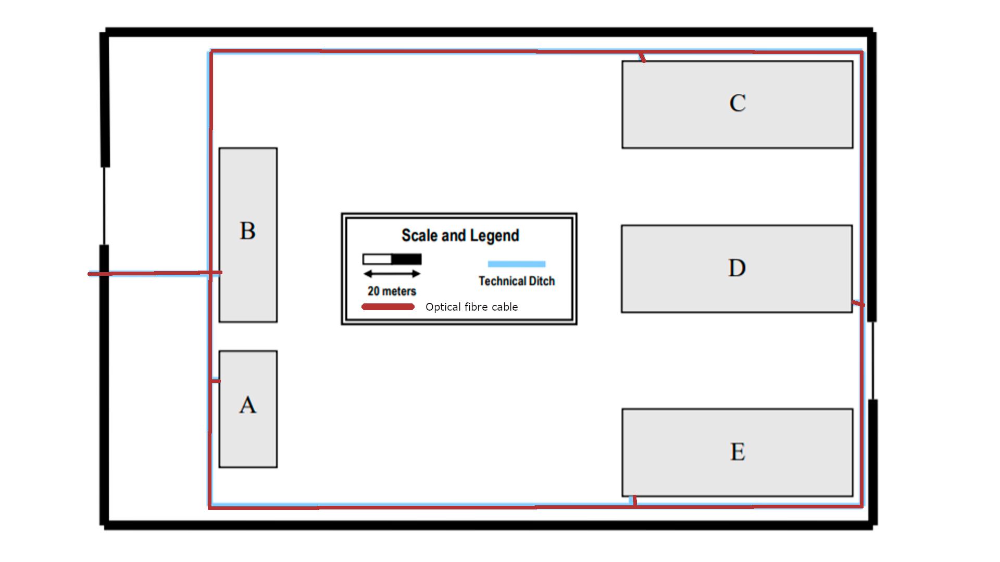

# Campus


Caso ocorra alguma falha no cabo de fibra ótica ao longo do campus, foi adicionado um cabo complementar a cada edifício ligado ao Main cross-connector, para além da figura demostrada, para garantir conexão e segurança



Inventário:

    -812 m de Multimode Optical Fibre


| Medidas | Total imagem (cm) | Total (m) |

| Campus | 48.7 | 812 |
```
Escala : 1.2 cm <-> 20m
```