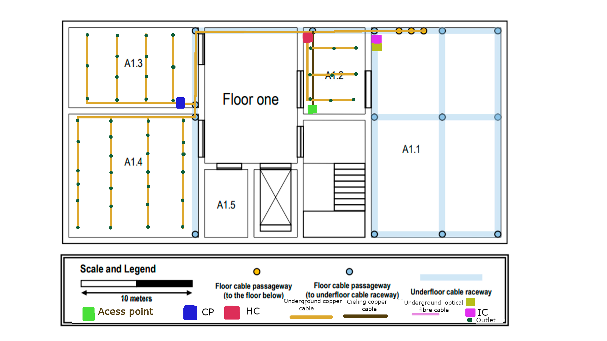

# Edifício A

Para além da cobertura exterior, fiquei tambem encarregue de cobrir o edificio A, o edificio de datacentre, com Wifi e coberura estruturada de cabo

# Piso 0

A conecção aos edicifios exteriores é alcançada a partir do cabo de fibra ótica que provém do exterior do edifício,entrando através do *"Passage way to the external ditch"* e atravessa o *"Underfloor cable raceway", conseguindo aceder ao cabo através dos *"Floor cable passageway"* nas salas A0.1 e A0.2 e A0.3.

É colocado na sala A0.2 um HC (*Horizontal cross-connect*) que extende ligação aos 26 *outlets* desta mesma sala. É também nesta sala que existe passagem de cabo e cobre para o piso acima.
Em relação à sala A0.1 é colocado um CP (*Consolidation Point*)que distribuí rede para as 17  *outlets* distrubuidas simetricamente e uniformemente. 
Para a sala A0.3 são apenas precisas 5 outlets, sendo estas extendidas do CP da sala A0.1.
Por fim para cobrir toda a área do Piso com Wifi é colocado um *Acess point* num local central do piso (A0.3) no teto. 

Este piso contém:

- 1 Horizontal cross-connect (HC)
- 1 Consolidation Point (CP) 
- 1 Switch com 24 portas
- 1 Switch com 48 portas
- 1 Access Point (Ac)
- 48 Outlets
- 1 metro de Cabo de Fibra Ótica (Valor aproximado)
- 133 metros de Cabo de Cobre (Valor aproximado)


# Piso 1

Neste piso encontra-se o main cross-connect do agregado de edifícios. Para facilitar todas as operações relacionadas com network, foi colocado em A1.1 (datacenter), tal como o Intermediate cross-connect (IC), sendo que o cabeamento e distribuição de outlets não são para ser colocadas nesta etapa de conhecimento.
Em A1.2 são colocadas 9 outlets uniformementa distribuidas, ligadas com cabo de cobre a um Horizontal cross-connect (HC). Esta sala também alberga um Access Point (Ac) colocado no teto, de forma a ficar num local central no piso com fim de distribuir Wifi sem falhas para todo o piso.
Por fim, nas salas A1.3 e A1.4 são colocados 14 e 26 outlets respectivamente, sendo que em A1.3 está colocado um Consolidation Point (CP) de forma a tornar estas distribuições possíveis.

Este piso contém:

- 1 Horizontal cross-connect (HC)
- 1 Intermediate cross-connect (IC)
- 1 Main cross-connect (MC)
- 1 Consolidation Point (CP) 
- 1 Switch com 24 portas
- 1 Switch com 48 portas
- 1 Access Point (Ac) ou Routers
- 49 Outlets
- 127 metros de Cabo de Cobre (Valor aproximado)




# Medidas

As medidas de cada sala de ambos os pisos são:

| Medidas | Ci(cm) | Li(cm) | Cr(m) | Lr(m) |          A(m²)           | Outlets |
| :-----: | :----: | :----: | :---: | :---: | :----------------------: | :------ |
|  A0.2   |  4.3   |  4.5   |  11.0  | 11.5  |            126.5            |26      |
|  A0.1   |  2.3   |  4.5   |  7.2  | 11.5  |            82.8            | 17      |
|  A0.3   |  ---   |  ---   |  ---  |  ---  |            ---            | 5      |
|  A1.1   |  ---   |  ---   |  ---  | ---  |            ---            | ---      |
|  A1.2   |  3   |  2.2   |  7.5  | 5.5  |            41            | 9      |
|  A1.3   |  5.5   |  4.5   | 5.53 | 11.5  |            66            | 14      |
|  A1.4   |  4.3   |  2.3   |  11  |   11.5   |            126.5            | 26       |
|  A1.5   |  ---   |  ---   |  ---  |   ---   |            ---            | ---       |


## Observações:

```
Piso 0:
Escala : 3.9cm <-> 10m

Piso 1:
Escala : 4cm <-> 10m
```

```
Sabendo que que temos que ter 2 outlets por metro quadrado é só fazer a formula resolvente:

10m² ------------- 2 outlets
Área ------------- x outlets

Logo temos que: 

Nº de Outlets por Sala = (A*2)/10
```