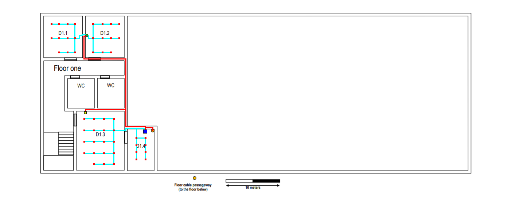

# Edifício D

Para este projeto, fiquei encarregue de cobrir o Edifício D o qual era necessário cobrir com outlets em todas todas as salas exceto as salas comuns e também garantir cobertura de Wi-fi. 

# Piso 0

O cabo de fibra ótica que provém do exterior do edifício entra através do *"Passage way to the external ditch"* e atravessa o *"Underfloor cable raceway"* e conseguimos aceder ao cabo através dos *"Floor cable passageway"* nas salas D0.3 e D0.4. É colocado na sala D0.4 um IC (*Intermediate cross-connect*) ao qual é ligado um HC (*Horizontal cross-connect*) que por sua vez liga aos *outlets* das salas previamente mencionadas. Para cobrir as salas D0.1 e D0.2 é colocado um CP (*Consolidation Point*) na sala D0.2 o qual distribuí rede para as *outlets* das salas D0.1 e D0.2. A distribuição de rede para o salão é feita através de um conjunto de CP's devido á grande quantidade de *outlets* a conectar. É também enviado cabo para o andar superior através do *"Celling cable passageway"*.Por fim para cobrir toda a área do Piso são colocados 3 AP's (Routers), 1 na sala D0.3 e os restantes 2 nas *"Suspended cable raceways"* suspensas no salão.

Este piso contém:

- 1 Intermediate cross-connect (IC)
- 2 Horizontal cross-connect (HC)
- 11 Consolidation Point (CP) ou Switches
  - 1 Switch com 24 portas
  - 10 Switch com 48 portas
- 3 Access Point (Ac) ou Routers
- 397 Outlets
- 399 Patch Cords
- 445 metros de Cabo de Fibra Ótica (Valor aproximado)
- 1932.45 metros de Cabo de Cobre (Valor aproximado)


# Piso 1

Para o primeiro Piso simplesmente conecta-se o cabo proveniente do andar inferior a um novo HC (*Horizontal cross-connect*) o qual conecta os outlets das salas D1.3 e D1.4. Para as restantes salas, tal como  no andar inferior, é colocado um CP (*Consolidation Point*) na sala D1.2 o qual distribuí rede para as *outlets* das salas D1.1 e D1.2. Para cobrir o piso com Wi-Fi é colocado um AP na sala D1.3 para ficar o mais centrado possível.

Este piso contém:

- 1 Horizontal cross-connect (HC)
- 1 Consolidation Point (CP) ou Switches
  - 1 Switch com 24 portas
- 1 Access Point (Ac) ou Routers
- 49 Outlets
- 51 Patch Cords
- 42. 1metros de Cabo de Fibra Ótica
- 434. 1metros de Cabo de Cobre




# Medidas

As medidas de cada sala de ambos os pisos são:

| Medidas | Ci(cm) | Li(cm) | Cr(m) | Lr(m) |          A(m²)           | Outlets |
| :-----: | :----: | :----: | :---: | :---: | :----------------------: | :------ |
|  D0.1   |  1.8   |  1.7   |  7.5  | 7.08  |            53            | 11      |
|  D0.2   |  1.8   |  1.7   |  7.5  | 7.08  |            53            | 11      |
|  D0.3   |  1.8   |  1.8   |  7.5  |  7.5  |            56            | 12      |
|  D0.4   |  1.8   |  1.4   |  7.5  | 5.83  |            43            | 9       |
|  Salão  |  6.8   |   15   | 28.3  | 62.5  | 1766.16 (ver comentário) | 354     |
|  D1.1   |  1.8   |  1.7   |  7.5  | 7.08  |            53            | 11      |
|  D1.2   |  1.8   |  1.7   |  7.5  | 7.08  |            53            | 11      |
|  D1.3   |  2.6   |  2.1   | 10.83 | 8.75  |            95            | 19      |
|  D1.4   |  1.8   |  1.2   |  7.5  |   5   |            38            | 8       |


## Observações:

```
Escala : 2.4cm <-> 10m
```

```
Real = [(imagem)*10]/2.4
```

```
Sabendo que que temos que ter 2 outlets por metro quadrado é só fazer a formula resolvente:

10m² ------------- 2 outlets
Área ------------- x outlets

Logo temos que: 

Nº de Outlets por Sala = (A*2)/10
```

```
No cálculo da Área do salão temos que ter em consideração que este não é um retângulo logo temos que calcular a área do retângulo e subtraír á área total do salão (se este fosse um retângulo) a área que a sala D0.4 ocupa do salão. Logo temos que:

Área do Salão = A1 - A2

onde,

A1 = 28.3 * 62.5 = 1768.75m²
A2 = 1.3 * 1.99 = 2.587m²
```
