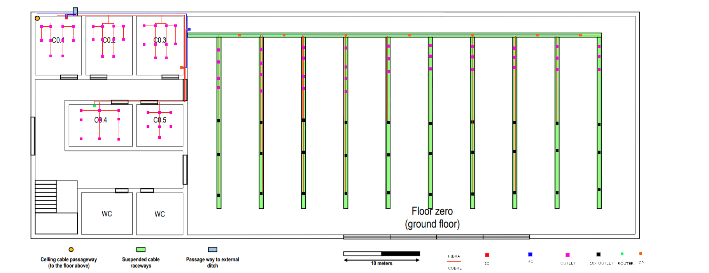
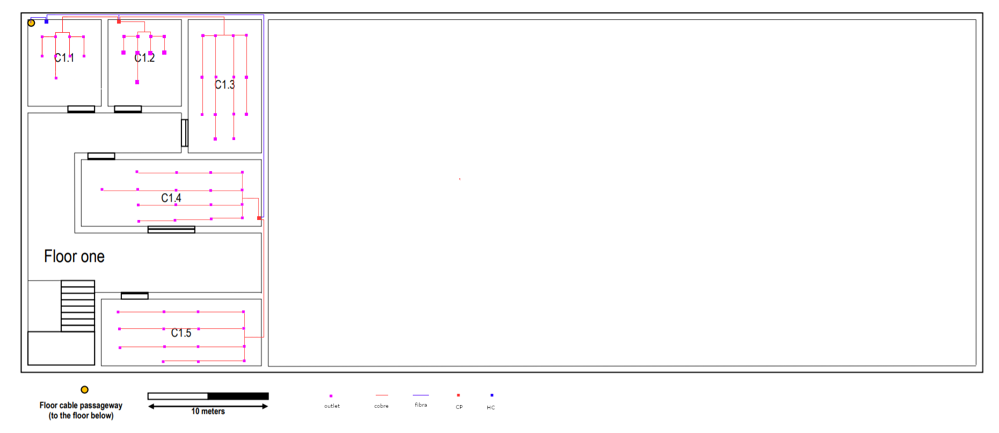

# Edifício C

# Piso 0

O cabo de fibra ótica provém do exterior do edifício ("Passage way to the external ditch"). É colocado na sala C0.1 um IC (Intermediate cross-connect) ao qual é ligado um HC no salão (Horizontal cross-connect). Para cobrir as salas C0.1, C0.2, C0.3, C0.4, C0.5 é colocado um CP (Consolidation Point) na sala C0.3 para distribuir rede entre os outlets das salas. A distribuição de rede para o salão é feita através de um conjunto de CP's devido á grande quantidade de outlets a conectar. É também enviado cabo para o andar superior através do "Celling cable passageway".Por fim para cobrir toda a área é colocado um AP (Router) na sala C0.4.


- 1 Intermediate cross-connect (IC)
- 1 Horizontal cross-connect (HC)
- 8 Consolidation Point (CP) com 48 portas
- 1 Router
- 380 Outlets
- 382 Patch Cords
- 236.94 metros de Cabo de Fibra Ótica (Valor aproximado)
- 6787 metros de Cabo de Cobre (Valor aproximado)



# Piso 1

O cabo proveniente do andar inferior conecta-se a um novo HC (*Horizontal cross-connect*) o qual conecta a dois cp's, um colocado em C1.2 e outro em C1.4 para distribuir rede entre os outlets das salas.

- 1 Horizontal cross-connect (HC)
- 2 Consolidation Point (CP) com 48 portas
- 68 Outlets
- 70 Patch Cords
- 44.75 metros de Cabo de Fibra Ótica (Valor aproximado)
- 755.75 metros de Cabo de Cobre (Valor aproximado)





# Medidas

| Medidas | Ci(cm) | Li(cm) | Cr(m) | Lr(m) |          A(m²)           | Outlets |
| :-----: | :----: | :----: | :---: | :---: | :----------------------: | :------ |
|  C0.1   |  1.2   |  1.55   |  6  | 7.75  |            46.5            | 10      |
|  C0.2   |  1.2   |  1.55   |  6  | 7.75  |            46.5            | 10      |
|  C0.3   |  1.2   |  1.55   |  6  |  7.75  |            46.5            | 10      |
|  C0.4   |  1.65   |  1.1   |  8.25  | 5.5  |            43.38            | 9       |
|  C0.5   |  1.2   |  1.1   |  6  | 5.5  |            33            | 7       |
|  Salão  |  11.7   |   5.7   | 58.5  | 28.5  | 1667.25 | 334     |
|  C1.1   |  1.2   |  1.4   |  6  | 7  |            42            | 9      |
|  C1.2   |  1.2   |  1.4   |  6  | 7  |            42            | 9      |
|  C1.3   |  1.2   |  2.2   | 6 | 11  |            66            | 14      |
|  C1.4   |  3   |  1.1   |  15  |   5.5   |            82.5            | 17       |
|  C1.5   |  2.65   |  1.1   |  13.25  |   5.5   |            72.88            | 15       |


```
Escala : 2cm <-> 10m
```

```
Real = [(imagem)*10]/2
```

```
Sabendo que que temos que ter 2 outlets por metro quadrado é só fazer a formula resolvente:

10m² ------------- 2 outlets
Área ------------- x outlets

Logo temos que: 

Nº de Outlets por Sala = (A*2)/10
```

```
Piso 0

- Calha 1 -> 34 outlets
- Calha 2 -> 34 outlets
- Calha 3 -> 34 outlets
- Calha 4 -> 34 outlets
- Calha 5 -> 33 outlets
- Calha 6 -> 33 outlets
- Calha 7 -> 33 outlets
- Calha 8 -> 33 outlets
- Calha 9 -> 33 outlets
- Calha 10 -> 33 outlets

|         | Calha 1 | Calha 2 | Calha 3 | Calha 4 | Calha 5 | Calha 6 | Calha 7 | Calha 8 | Calha 9 | Calha 10 |
| :-----: | :-----: | :-----: | :-----: | :-----: | :-----: | :-----: | :-----: | :-----: | :-----: | :------: |
|  CP 1   |    0    |    20   |    34   |    34   |    33   |    33   |    33   |    33   |    33   |    33    |
|  CP 2   |    -    |    0    |    6    |    34   |    33   |    33   |    33   |    33   |    33   |    33    |
|  CP 3   |    -    |    -    |    0    |    0    |    25   |    33   |    33   |    33   |    33   |    33    |
|  CP 4   |    -    |    -    |    -    |    -    |    0    |    10   |    33   |    33   |    33   |    33    |
|  CP 5   |    -    |    -    |    -    |    -    |    -    |    0    |    0    |    28   |    33   |    33    |
|  CP 6   |    -    |    -    |    -    |    -    |    -    |    -    |    -    |    -    |    13   |    33    |
|  CP 7   |    -    |    -    |    -    |    -    |    -    |    -    |    -    |    -    |    0    |    0     |

- CP 1 -> liga a 34 outlets da calha 1 e 14 da calha 2
- CP 2 -> liga a 20 outlets da calha 2 e 28 da calha 3
- ...