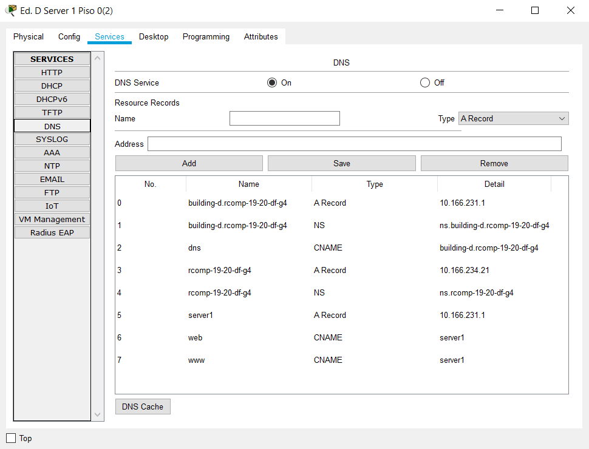
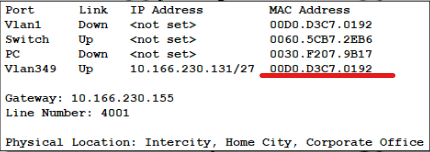
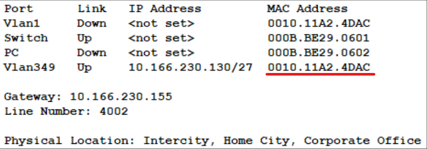

RCOMP 2019-2020 Project - Sprint 3 - Member 1171611 folder
===========================================


## **Decisões Tomadas:**

No momento do *Planning* foi definido que para PROCESS-ID do **OSPF** adotar a seguinte nomenclatura:

- 101 para o Edifício A;
- 202 para o Edifício B;
- 303 para o Edifício C;
- 404 para o Edifício D;
- 505 para o Edifício E;

Também para o **AREA-NUMBER**, seguimos o mesmo estilo:

- Área 0 para o BackBone;

- Área 1 para o Edifício A;
- Área 2 para o Edifício B;
- Área 3 para o Edifício C;
- Área 4 para o Edifício D;
- Área 5 para o Edifício E;

Para o meu Edifício foi utilizado o **PROCESS-ID 404** e a **área 4 para o AREA-NUMBER**.


Relativamente aos **HTTP servers**, depois de adicionar-mos o novo DMZ, alteramos a configuração do ficheiro index.html para identificar o Edifício em questão.

Para o meu Edifício, a alteração foi esta:

```
<html>

<center><font size='+2' color='blue'>Edifício D</font></center>

<hr>Welcome to Edifício D. Hope you have a good time.

<p>Quick Links:

<br><a href='helloworld.html'>A small page</a>

<br><a href='copyrights.html'>Copyrights</a>

<br><a href='image.html'>Image page</a>

<br><a href='cscoptlogo177x111.jpg'>Image</a>

</html>
```


Para o **DHCPv4 *service*** decidiu-se que o nome da DHCP Pool seguiria a seguinte nomenclatura:

**X_NETWORK**

onde X é o identificador do Edifício.

No meu Edifício foram definidas as seguintes DHCP Pools:

- **D_Floor0**

- **D_Floor1**

- **D_Wifi**

- **D_VoIP**

  

Também dando seguimento ao estilo de nomenclaturas utilizado para o OSPF, no registo dos telefones, no momento da definição do Dial Number dos telefones, os números atribuídos começam em 1000 e acabam em 5999, ou seja, a gama [1000-1999] para o Edifício A até á gama [5000-5999] para o Edifício E.

Para o meu Edifício usei a gama de **Dial Numbers de [4000-4999]**. Visto que no meu Edifício tenho 2 dispositivos VoIP usei o número **4001** para o primeiro telefone e **4002** para o segundo.


Na definição dos *DNS domains*, segui as instruções do enunciado e defini todas as domains pedidas.


## Desenvolvimento:


#### Configurar OSPF:

De forma a iniciar o trabalho, retomei o trabalho resultante do Sprint 2 (campus.pkt) e eliminei todas as *routing tables* que já se encontravam definidas, em todos os routers de todos os edifícios.

De seguida, em cada router de cada Edifício executei os seguintes comandos:

```
Router(config)# router ospf PROCESS-ID

Router(config-router)# network 10.166.234.0 255.255.254.0 area 0

Router(config-router)# network NETWORK-ADDRESS NETWORK-WILDCARD area AREA-NUMBER 
```

O PROCESS-ID depende o do Edifício onde estou a efetuar a configuração. Como mencionei nas decisões tomadas:

- 101 para o Edifício A;
- 202 para o Edifício B;
- 303 para o Edifício C;
- 404 para o Edifício D;
- 505 para o Edifício E;

O segundo comando será o mesmo para todos os routers pois refere-se á network do *Backbone*.

O último comando é semelhante ao segundo mas será referente á network atribuída para o Edifício onde estamos a fazer a configuração. O NETWORK-ADDRESS será a network do edifício , o NETWORK-WILDCARD é a máscara da rede a qual utilizamos 255.255.254.0 que abrange 512 endereços para garantir a que outra network também seja incluída na área que estamos a definir no AREA-NUMBER. Por exemplo, para o meu Edifício, onde uso as networks 10.166.230.0 e 10.166.231.0, usando a máscara 255.255.254.0 vou abranger ambas as redes na mesma área.


#### HTTP Servers:

Foi colocado outro DMZ e na página de Services ligar o HTTP.


#### DHCPv4 service/DNS :

Na configuração dos **DHCPs** foram definidos **4 DHCP Pools**. Foram efetuados os seguintes comandos para cada DHCP Pool exceto para o DMZ e também dois comandos para definir o **DOMAIN-NAME** e o **DNS-SERVER**:

Para a Pool D_Floor0:

```
Router(config)# ip dhcp pool D_Floor0

Router(dhcp-config)# network 10.166.230.64 255.255.255.192

Router(dhcp-config)# default-router 10.166.230.120

Router(dhcp-config)# domain-name building-d.rcomp-19-20-df-g4

Router(dhcp-config)# dns-server 10.166.231.1
```

Para a Pool D_Floor1:

```
Router(config)# ip dhcp pool D_Floor1

Router(dhcp-config)# network 10.166.230.0 255.255.255.192

Router(dhcp-config)# default-router 10.166.230.52

Router(dhcp-config)# domain-name building-d.rcomp-19-20-df-g4

Router(dhcp-config)# dns-server 10.166.231.1
```

Para a Pool D_Wifi:

```
Router(config)# ip dhcp pool D_Wifi

Router(dhcp-config)# network 10.166.230.192 255.255.255.192

Router(dhcp-config)# default-router 10.166.230.254

Router(dhcp-config)# domain-name building-d.rcomp-19-20-df-g4

Router(dhcp-config)# dns-server 10.166.231.1
```

Para a Pool D_VoIP:

```
Router(config)# ip dhcp pool D_VoIP

Router(dhcp-config)# default-router 10.166.230.155

Router(dhcp-config)# option 150 ip 10.166.230.155

Router(dhcp-config)# network 10.166.230.130 255.255.255.224

Router(dhcp-config)# domain-name building-d.rcomp-19-20-df-g4

Router(dhcp-config)# dns-server 10.166.231.1
```

 

Primeiro foi excluído o IP do *gateway* de cada VLAN para que este nunca seja atribuído. De seguida para cada VLAN foi definido o serviço DHCP de modo a ser possível atribuir de forma dinâmica endereços de nodes IPv4 nos *end-devices*. Foi também definido um *DNS Domain Name* e o *DNS* server para ser utilizado pelos dispositivos. Depois de todos os comandos foi alterado o IP *configuration* dos *PC's* e do Laptop para o modo DHCP e assim foi atribuído automaticamente um IP a cada *end-devices.*


Defini os seguintes DNS *Domains* de acordo com os que estava especificado no enunciado: 


#### *VoIPs:*

​	Antes de qualquer configuração relativa aos dispositivos *VoIP* foi necessário configurar a porta do o *Switch* a que este está ligado. Utilizei a seguinte sequência de comandos:

```
Switch(config)# interface fa2/1

Switch(config-if)# switchport mode access

Switch(config-if)# switchport voice vlan 349

Switch(config-if)# no switchport access vlan
```

A VLAN 349, definida no Sprint 2, é a VLAN definida para os dispositivos VoIP no Edifício D.


Relativamente ao registro dos telefones e atribuição do número de diretório efetuei os seguintes comandos no router do meu edifício:

```
Router(config)# telephony-service

Router(config-telephony)# no auto-reg-ephone

Router(config-telephony)# ip source-address 10.166.230.155 port 2000

Router(config-telephony)# max-ephones 25

Router(config-telephony)# max-dn 25


Router(config-telephony)# create cnf-files


Router(config)# ephone-dn 1

Router(config-ephone-dn)# number 4001

Router(config)# ephone-dn 2

Router(config-ephone-dn)# number 4002


Router(config)# ephone 1

Router(config-ephone)# mac-address 00D0.D3C7.0192

Router(config-ephone)# button 1:1

Router(config)# ephone 2

Router(config-ephone)# mac-address 0010.11A2.4DAC

Router(config-ephone)# button 1:2
```

Efetuei o registo dos telefones manualmente utilizando os MAC-ADRESSES associados aos mesmos como podemos verificar nas configurações abaixo.






#### Configurar *Static NAT* (*Network Address Translation*):

Para as solicitações de HTTP e HTTPS recebidas na interface do *backbone* do router utilizei os seguintes comandos para configurar as conexões TCP para as portas 80 e 443: 

```
Router(config)#ip nat inside source static tcp 10.166.231.6 80 10.166.234.21 80
Router(config)#ip nat inside source static tcp 10.166.231.6 443 10.166.234.21 443
```

Para as solicitações DNS recebidas na interface do *backbone* do router utilizei os seguintes comandos para configurar as conexões TCP e UDP visto que o serviço DNS pode usar ambas as conexões mas para este caso só para a porta número 53:

```
Router(config)#ip nat inside source static udp 10.166.231.1 53 10.166.234.21 53 
Router(config)#ip nat inside source static tcp 10.166.231.1 53 10.166.234.21 53
```


#### Configurar *Static Firewall* (*ACLs*):

Como último ponto do trabalho configurei todas as ACLs (Access Control Lists), após verificar que todos os pontos anteriores estavam a funcionar, utilizando os seguintes comandos no router do meu edifício: 


**ACL PISO1:**

```
Router(config)#ip access-list extended PISO1

Router(config-ext-nacl)#deny ip any 10.166.230.0 0.0.0.63

Router(config-ext-nacl)#permit icmp any any 

Router(config-ext-nacl)#permit udp host 0.0.0.0 host 255.255.255.255

Router(config-ext-nacl)#deny ip any host 10.166.230.120

Router(config-ext-nacl)#deny ip any host 10.166.230.52

Router(config-ext-nacl)#deny ip any host 10.166.230.254

Router(config-ext-nacl)#deny ip any host 10.166.231.252

Router(config-ext-nacl)#deny ip any host 10.166.230.155

Router(config-ext-nacl)#deny ip any host 10.166.234.21

Router(config-ext-nacl)#permit ip any any
```


**ACL PISO0:**

```
Router(config)#ip access-list extended PISO0

Router(config-ext-nacl)#deny ip any 10.166.230.64 0.0.0.63

Router(config-ext-nacl)#permit icmp any any

Router(config-ext-nacl)#permit udp host 0.0.0.0 host 255.255.255.255

Router(config-ext-nacl)#deny ip any host 10.166.230.120

Router(config-ext-nacl)#deny ip any host 10.166.230.52

Router(config-ext-nacl)#deny ip any host 10.166.230.254

Router(config-ext-nacl)#deny ip any host 10.166.231.252

Router(config-ext-nacl)#deny ip any host 10.166.230.155

Router(config-ext-nacl)#deny ip any host 10.166.234.21

Router(config-ext-nacl)#permit ip any any
```


**ACL WIFI:**

```
Router(config)#ip access-list extended WIFI

Router(config-ext-nacl)#deny ip any 10.166.230.192 0.0.0.63

Router(config-ext-nacl)#permit icmp any any

Router(config-ext-nacl)#permit udp host 0.0.0.0 host 255.255.255.255

Router(config-ext-nacl)#deny ip any host 10.166.230.120

Router(config-ext-nacl)#deny ip any host 10.166.230.52

Router(config-ext-nacl)#deny ip any host 10.166.230.254

Router(config-ext-nacl)#deny ip any host 10.166.231.252

Router(config-ext-nacl)#deny ip any host 10.166.230.155

Router(config-ext-nacl)#deny ip any host 10.166.234.21

Router(config-ext-nacl)#permit ip any any
```


**ACL DMZ:**

```
Router(config)#ip access-list extended DMZ

Router(config-ext-nacl)#deny ip any 10.166.231.0 0.0.0.255

Router(config-ext-nacl)#permit icmp any any	

Router(config-ext-nacl)#permit tcp any host 10.166.234.21 eq www

Router(config-ext-nacl)#permit tcp any host 10.166.234.21 eq 443

Router(config-ext-nacl)#permit tcp any host 10.166.234.21 eq domain

Router(config-ext-nacl)#permit udp any host 10.166.234.21 eq domain

Router(config-ext-nacl)#permit ip 10.166.231.0 0.0.0.255 any

Router(config-ext-nacl)#deny ip any host 10.166.230.120

Router(config-ext-nacl)#deny ip any host 10.166.230.52

Router(config-ext-nacl)#deny ip any host 10.166.230.254

Router(config-ext-nacl)#deny ip any host 10.166.231.252

Router(config-ext-nacl)#deny ip any host 10.166.230.155

Router(config-ext-nacl)#deny ip any host 10.166.234.21

Router(config-ext-nacl)#permit ip any any
```


**ACL VOIP:**

```
Router(config)#ip access-list extended VOIP

Router(config-ext-nacl)#deny ip any 10.166.230.129 0.0.0.31

Router(config-ext-nacl)#permit icmp any any

Router(config-ext-nacl)#permit udp host 0.0.0.0 host 255.255.255.255

Router(config-ext-nacl)#permit tcp any host 10.166.230.160 eq 2000 	

Router(config-ext-nacl)#permit udp any host 10.166.230.160 eq tftp 

Router(config-ext-nacl)#deny ip any host 10.166.230.120

Router(config-ext-nacl)#deny ip any host 10.166.230.52

Router(config-ext-nacl)#deny ip any host 10.166.230.254

Router(config-ext-nacl)#deny ip any host 10.166.231.252

Router(config-ext-nacl)#deny ip any host 10.166.230.155

Router(config-ext-nacl)#deny ip any host 10.166.234.21

Router(config-ext-nacl)#permit ip any any
```


**ACL BACKBONE:**

```
Router(config)#ip access-list extended BACKBONE

Router(config-ext-nacl)#deny ip any 10.166.230.0 0.0.0.255

Router(config-ext-nacl)#deny ip any 10.166.231.0 0.0.0.255

Router(config-ext-nacl)#permit ospf any host 224.0.0.5

Router(config-ext-nacl)#permit ospf any host 224.0.0.6

Router(config-ext-nacl)#permit ospf any host 10.166.234.21

Router(config-ext-nacl)#permit icmp any any

Router(config-ext-nacl)#permit tcp any host 10.166.234.21 eq www

Router(config-ext-nacl)#permit tcp any host 10.166.234.21 eq 443

Router(config-ext-nacl)#permit udp any host 10.166.234.21 eq domain

Router(config-ext-nacl)#permit tcp any host 10.166.234.21 eq domain

Router(config-ext-nacl)#deny ip any host 10.166.230.120

Router(config-ext-nacl)#deny ip any host 10.166.230.52

Router(config-ext-nacl)#deny ip any host 10.166.230.254

Router(config-ext-nacl)#deny ip any host 10.166.231.252

Router(config-ext-nacl)#deny ip any host 10.166.230.155

Router(config-ext-nacl)#deny ip any host 10.166.234.21

Router(config-ext-nacl)#permit ip any any
```

